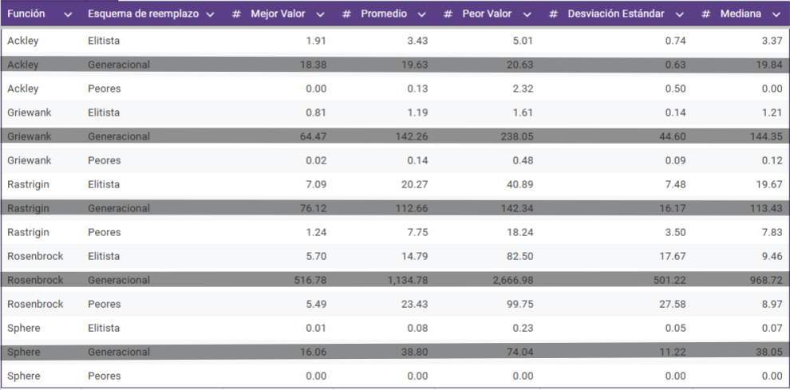
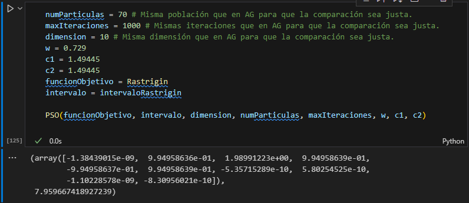
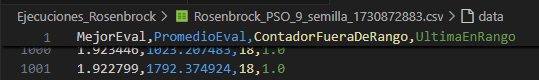

# <!--fit-->PSO para funciones continuas mono-objetivo :bird:

- Torres Ochoa María Adelina

---

## ¿Qué es?

- **Optimización por Enjambre de Partículas:** Inspirado en bandadas de aves. Las partículas "vuelan" a través del espacio de soluciones, ajustando su posición en función de su experiencia individual y colectiva (Kennedy y Eberhart 1995).
- Las partículas tienen dos características: posición y velocidad.

---

## Alcance del proyecto:

- Implementación del PSO en Python con las 5 funciones de prueba de las tareas.
- Comparación con AG de reemplazo elitista y reemplazo de los peores mediante gráfica de evolución promedio de aptitud, tabla de datos estadísticos y boxplot.

---

- Estamos en $\mathbb{R}^n$. Supongamos que tenemos $k$ partículas.
- **La posición** de cada partícula $X_i$ al tiempo $t$:
$X_i(t) = (x_{i1}(t), x_{i2}(t), ..., x_{in}(t))$.
- Velocidad de $X_i$ al tiempo $t$: 
$V_{i}(t) = (v_{i1}(t), v_{i2}(t), ..., v_{in}(t))$.
- Para cada $X_i$, $P_i(t)=(p_{i1}(t), p_{i2}(t), ..., p_{in}(t))$ representa la **mejor posición visitada** hasta el tiempo $t$.
- $X^{\bigstar}(t) = (x_{1}(t), x_{2}(t), ..., x_{n}(t))$ es la **mejor posición visitada por el enjambre** hasta el tiempo $t$

---

## <!--fit-->Ravioli ravioli dame la formuoli :spaghetti:

- Para cada partícula $X_i$:
    - $V_{i}(t+1)=$:
    $wV_{i}(t) + c_1 r_1 [P_i(t) - X_i(t)] + c_2 r_2 [X^{\bigstar}(t) - X_i(t)]$
        - PSO original no contempla a $w$ (Shi y Eberhart 1998).
        - Peso grande: Mayor exploración.
        - Peso pequeño: Mayor explotación.
    - $X_i(t+1) = X_i(t) + V_{i}(t+1)$

---

## Pasos:

1. Inicializamos una población aleatoria.
2. En cada posición de cada partícula se evalúa la función objetivo.
3. Comparamos la aptitud de cada partícula con la de su respectivo $P_i$ y lo actualizamos de ser necesario. 
4. Actualizamos (de ser necesario) $X^\bigstar$.
5. Cambiamos las posiciones del enjambre de acuerdo a las ecuaciones.
6. Repetimos los pasos **2.** a **5.** hasta que se cumpla el criterio de paro.

---

## Parámetros elegidos:
```python
numParticulas = 70 # Misma población que en AG para que la comparación sea justa.
maxIteraciones = 1000 # Mismas iteraciones que en AG para que la comparación sea justa.
dimension = 10 # Misma dimensión que en AG para que la comparación sea justa.
w = 0.729
c1 = 1.49445
c2 = 1.49445 
funcionObjetivo = Ackley/Griewank/Rastrigin/Rosenbrock/Sphere
intervalo = intervalofuncionObjetivo
```
--------

## ¿Por qué esos parámetros?

**PSO con factor de constricción (por Clerc y Kennedy 2002):**

C:\Users\Chinitok666\Documents\GitHub\C-mputo-Evolutivo-primeros-intentos\PSO\image2.png

- Única restricción: $\varphi = c_1 + c_2 > 4$

- Típicamente $k=0.729$, $\varphi = 4.1$.

---

- En el PSO (sin factor de constricción), lo anterior es matemáticamente equivalente a $w = 0.729$ y $c_1 = c_2 = 1.49445$ 
($1.49445 = \frac{4.1}{2}(0.729) = \frac{\varphi}{2}\cdot k$)

- **¿Por qué usar PSO con factor de constricción?** "Con la esperanza de que pueda asegurar que el PSO converja" (Shi 2004).

---

## Resultados obtenidos:

**AG :herb::**



---

**PSO :bird:**


----

**¿Por qué permitir salirse del espacio de búsqueda?**

```python
# Aplicamos la restricción para mantener las partículas dentro del intervalo [a, b]
particulas = np.clip(particulas, a, b)
```
- Obtenemos:


---

**Si podemos salirnos:**



---

**Conclusiones:**

- La implementación es sencilla.
- Los parámetros "buenos" son valores conocidos.
- PSO es más veloz que AG.
- PSO llega a salirse del intervalo de búsqueda.

---

## Fuentes :fountain::

- Implementación: https://induraj2020.medium.com/implementing-particle-swarm-optimization-in-python-c59278bc5846
- (Shi 2004): https://www.marksmannet.com/RobertMarks/Classes/ENGR5358/Papers/pso_bySHI.pdf
- Mi implementación: https://github.com/TomateTorres/C-mputo-Evolutivo-primeros-intentos/blob/main/PSO/PSO_Implementado.ipynb
