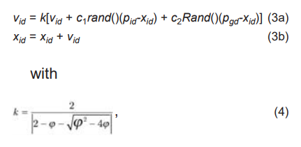
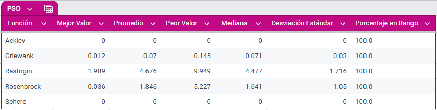

**Alcance:**

1. Implementar el PSO.

2. Compararlo con el AG de reemplazo elitista y de los peores.

-------------------------------------------------------

* Inspirado en bandadas de aves. Las partículas "vuelan" a través del espacio de soluciones, ajustando su posición en función de su experiencia individual y colectiva.

* La idea se divide en dos: partículas y enjambre. El enjambre se refiere a la colección de partículas que se mueven en el espacio de búsqueda.

* Una partícula es una solución candidata.

* Las partículas tienen dos características: posición y velocidad. 


---------------------------------------------------

Estamos en $\mathbb{R}^n$. Supongamos que tenemos $k$ partículas.

De este modo, la posición de cada partícula $X_i$ con $i \in \{1, 2, ..., k\}$ al tiempo $t$ es $X_i(t) = (x_{i1}(t), x_{i2}(t), ..., x_{in}(t))$.

La velocidad de una partícula $X_i$ al tiempo $t$ también es un vector en $\mathbb{R}^n$: $V_{i}(t) = (v_{i1}(t), v_{i2}(t), ..., v_{in}(t))$.

Para cada partícula $X_i$, $P_i(t)=(p_{i1}(t), p_{i2}(t), ..., p_{in}(t))$ representa la mejor posición visitada (por $X_i$) a lo largo de todo el proceso hasta el tiempo $t$.

Luego, $X^{\bigstar}(t) = (x_{1}(t), x_{2}(t), ..., x_{n}(t))$ es la mejor posición visitada por el enjambre hasta el tiempo $t$.

Para cada partícula $X_i$:

* Su velocidad al tiempo $t+1$ está dada por:
$V_{i}(t+1) = wV_{i}(t) + c_1 r_1 [P_i(t) - X_i(t)] + c_2 r_2 [X^{\bigstar}(t) - X_i(t)]$

* Su posición al tiempo $t+1$ está dada por:
$X_i(t+1) = X_i(t) + V_{i}(t+1)$

_____________________

La velocidad al tiempo $t$ de una partícula $X_i$, está dada por la suma de:

1. **Su inercia:** La velocidad de la partícula en la iteración anterior por un peso arbitrario $w$. Esta $w$ nos define qué tanto la velocidad previa de la partícula afecta a la presente. 
    * En el algoritmo original no se considera a $w$ (Shi y Eberhart 1998).
    * Peso grande: Mayor exploración.
    * Peso pequeño: Mayor explotación.

2. **Influencia personal:** Producto de: un peso arbitrario $c_1$, un número aleatorio $r_1$ (entre 0 y 1) por la diferencia de la mejor posición encontrada por la partícula y su posición en la iteración anterior ($P_i(t) - X_i(t)$).

3. **La influencia social:** Producto de: Un peso arbitrario $c_2$, un número aleatorio $r_2$ (entre 0 y 1) y la diferencia entre la posición de la mejor partícula del enjambre (en nuestro caso, la que minimiza a la función objetivo) y la posición de la partícula $X_i$ en la iteración anterior ($X^{\bigstar}(t) - X_i(t)$).

--------
**Pasos:**

1. Inicializamos una población de partículas con posiciones aleatorias dentro del espacio de búsqueda.
2. En cada posición de cada partícula se evalúa la función objetivo.
3. Comparamos la aptitud de cada partícula con la de su respectivo $P_i$ y lo actualizamos de ser necesario. 
4. Identificamos a la partícula con la mejor aptitud y la elegimos como $X^\bigstar$.
5. Cambiamos las velocidades del enjambre de acuerdo a las ecuaciones.
6. Repetimos los pasos **2.** a **5.** hasta que se cumpla el criterio de paro.

--------

**Parámetros elegidos:**
```
numParticulas = 70 # Misma población que en AG para que la comparación sea justa.
maxIteraciones = 1000 # Mismas iteraciones que en AG para que la comparación sea justa.
dimension = 10 # Misma dimensión que en AG para que la comparación sea justa.
w = 0.729
c1 = 1.49445
c2 = 1.49445 
funcionObjetivo = Ackley/Griewank/Rastrigin/Rosenbrock/Sphere
intervalo = intervalofuncionObjetivo
```
--------

**¿Por qué esos parámetros?**

PSO con factor de constricción (por Clerc y Kennedy 2002):



La única restricción es que $\varphi = c_1 + c_2 > 4$

Típicamente $k=0.729$, $\varphi = 4.1$.

En el PSO (sin factor de constricción), lo anterior es matemáticamente equivalente a $w = 0.729$ y $c_1 = c_2 = 1.49445$ ($1.49445 = \frac{4.1}{2}(0.729) = \frac{\varphi}{2}\cdot k$)

**¿Por qué usar PSO con factor de constricción?** "Con la esperanza de que pueda asegurar que el PSO converja" (Shi 2004).

-------------------------

**¿Por qué permitir salirse del espacio de búsqueda?**


