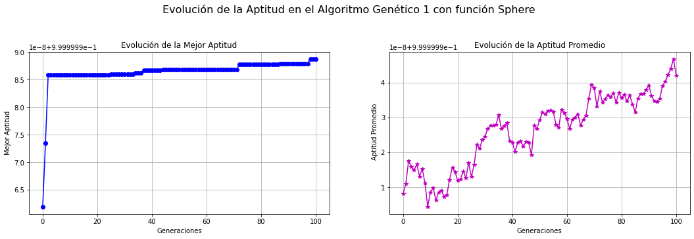
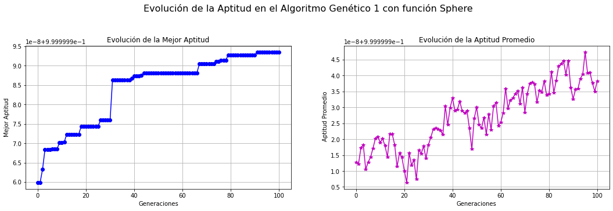
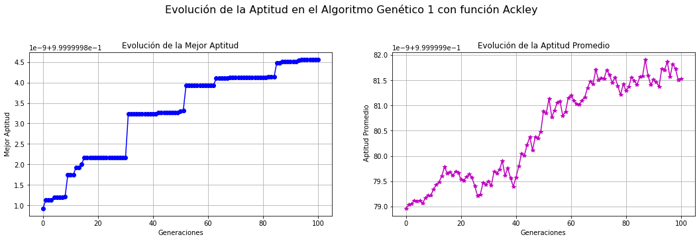
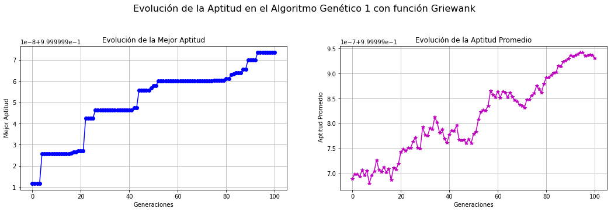
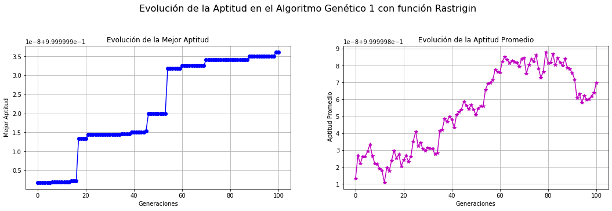
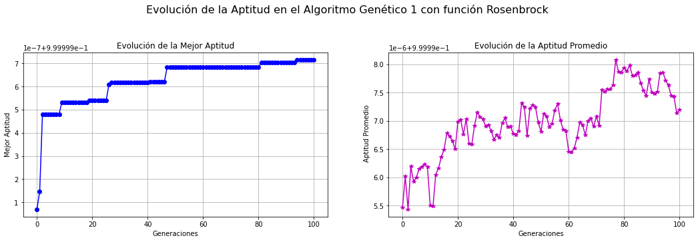

<h1 style="text-align: center; font-size: 48px;">Tarea 3</h1>
<h1 style="text-align: center; font-size: 48px; font-style: italic;">Los tres que mutan</h1>

1. Rojas Romero Emmanuel Lucano  
2. Torres Ochoa Maria Adelina  
3. Vargas Bautista Frida Michelle

**Considere los siguientes problemas de optimización continua:** 

 **a) Sphere**

$$
f(\mathbf{x}) = \sum_{i=1}^{n} x_i^2
$$

donde $x_i \in [-5.12, 5.12]$.

**b) Ackley**

$$
f(\mathbf{x}) = -20 \exp\left( -0.2 \sqrt{\frac{1}{n} \sum_{i=1}^{n} x_i^2} \right) - \exp\left( \frac{1}{n} \sum_{i=1}^{n} \cos(2\pi x_i) \right) + 20 + e
$$

donde $x_i \in [-30, 30]$.

**c) Griewank**

$$
f(\mathbf{x}) = 1 + \frac{1}{4000} \sum_{i=1}^{n} x_i^2 - \prod_{i=1}^{n} \cos\left( \frac{x_i}{\sqrt{i}} \right)
$$

donde $x_i \in [-600, 600]$.

**d) Rastrigin**

$$
f(\mathbf{x}) = 10n + \sum_{i=1}^{n} \left( x_i^2 - 10 \cos(2\pi x_i) \right)
$$

donde $x_i \in [-5.12, 5.12]$.

 **e) Rosenbrock**

$$
f(\mathbf{x}) = \sum_{i=1}^{n-1} \left[ 100 (x_{i+1} - x_i^2)^2 + (1 - x_i)^2 \right]
$$

donde $x_i \in [-2.048, 2.048]$.

# Ejercicio 1. Algoritmo Genético - Optimización continua.

## 1.a) Describe e implementa un algoritmo genético para las funciones anteriores de optimización continua.

Se deben implementar y utilizar los siguientes componentes:

1. **Representación binaria para las soluciones**
2. **Selección de padres por el método de la ruleta**  
   Justifica y utiliza un método de transformación de la función de aptitud que se pueda aplicar a un problema de minimización (como las funciones de prueba de esta tarea).
3. **Operador de cruza de n puntos**
4. **Mutación flip**
5. **Reemplazo generacional con elitismo**  
   [Se debe garantizar que la mejor solución siempre permanece en la población]

# Solución del ejercicio 1. 
Antes de ir directamente al pseudocódigo de nuestro algoritmo genético, vamos a preparar el terreno describiendo las funciones auxiliares que usaremos. 

La primera de ellas nos ayudará a generar una población inicial. Esta función tiene la siguiente estructura: 

## Algoritmo para generar Población

#### **Entrada:**
- `k`: Representa el tamaño de la mitad de la población.
- `n`: Dimensión del problema (número de variables de cada individuo).
- `intervalo`: Es el intervalo `[a, b]` en el que toman valores nuestras variables.

#### **Salida:**
- `poblacionLista`: Lista de 2k individuos generados aleatoriamente, donde cada individuo es un vector de dimensión `n` con valores dentro del intervalo `[a, b]`.

####  **Pasos:**

   - **Paso 1: Definir el intervalo**
     - `a = intervalo[0]`
     - `b = intervalo[1]`

     Lo único que se hace en esta parte es definir el intervalo donde se mueven las variables del problema. 

   - **Paso 2: Generar una matriz aleatoria de tamaño `(2k, n)`**
     - `poblacionMatriz = Generar_Numeros_Aleatorios_Uniformes(a, b, tamaño=(2*k, n))`

     Se genera una matriz de tamaño `(2k, n)` usando una distribución uniforme en el intervalo `[a, b]`. Cada fila de la matriz representa un individuo de la población, y cada columna representa una de las variables de ese individuo.

   - **Paso 3: Convertir la matriz en una lista de listas**
     - `poblacionLista = Convertir_Matriz_A_Lista(poblacionMatriz)`

     Para facilitar el manejo de los datos, se convierte la matriz generada en una lista de listas. Cada sublista corresponde a un individuo, y cada elemento de la sublista corresponde a una variable de ese individuo. 

   - **Paso 4: Devolver la lista de población**
     - `return poblacionLista`

   Simplemente nos devuelve la lista de individuos. Esta lista representa la población inicial de 2k individuos.

Mas adelante vamos a hacer la selección de padres de la siguiente generación por medio de un método tipo ruleta. Este método tiene la siguiente estructura: 

 Proceso básico:
**1. Asignación de probabilidades:** A cada individuo se le asigna una probabilidad de selección proporcional a su aptitud. Esto significa que los individuos con mayor aptitud tienen más probabilidades de ser seleccionados.

**2. Construcción de la ruleta:** Las probabilidades acumuladas se utilizan para crear una "ruleta". 

**3. Selección de individuos:** Se gira la ruleta varias veces para seleccionar individuos. Cada vez que se gira, se elige un individuo basado en las probabilidades. Así, los individuos con mayor aptitud tienen más oportunidades de ser seleccionados.

La siguiente función auxiliar que usaremos nos ayudará a determinar las probabilidades de los individuos de nuestra población y nos dará al individuo más apto. 
El algoritmo tiene la siguiente estructura: 

## Algoritmo para cálculo de aptitud

#### **Entrada:**
- `funcion`: Nuestra función de prueba a analizar.
- `poblacion`: Una lista de 2k individuos, donde cada individuo es un vector. 

#### **Salida:**
- `probabilidades`: Lista de probabilidades de selección (`p_i`) de cada individuo.

#### **Pasos:**
   - **Paso 1: Evaluar cada individuo en la población**
     - `evaluaciones = [funcion(individuo) para cada individuo en poblacion]`
       Se evalúa cada individuo de la población utilizando la función de prueba. El resultado es una lista de evaluaciones para todos los individuos.

   - **Paso 2: Calcular la aptitud de cada individuo**
     - `aptitudes = [exp(1e-9 * (-evaluacion)) para cada evaluacion en evaluaciones]`

     Se calcula la aptitud de los individuos de la población a partir de la siguiente transformación: 
     Dado $v_i$ un individuo de nuestra población, definimos una función de aptitud dada por $g(v_i)=e^{-10^{-9}f(v_i)}$, donde $f$ es la función de prueba a minimizar. Esta manera de evaluar la tomamos asi teniendo las siguientes consideraciones: 

**1)** Dado que en un futuro queremos minimizar una función, podemos entonces cambiar este problema a uno de maximización a partir de componer a la funcion $f$ con la función $e^{-x}$. Esto es ventajoso pues sin inportar como sea $f$, $e^{-f}$ siempre será una función no negativa. Además, $e^{-x}$ es una función estrictamente decreciente, así, cuando maximizamos $e^{-f}$ estamos minimizando $f$ de manera indirecta, pues, valores "pequeños" de $f$ nos da valores grandes de $e^{-f}$. 

**2)** Sabemos que si tenemos mala suerte y resulta que $f$ toma valores muy grandes, entonces $e^{-f}$ toma valores muy pequeños, lo cual resultará problematico para nosotros al momento de definir nuestra medida de probabilidad (los 3 que mutan del futuro son testigo de que si no se hace eso, los núumeros se empezarán a guardar como cero y empezaran a haber cosas raras del estilo 0/0). Por tanto es conveniente tomar una constante de escalamiento. La constante que elegimos fue 10^{-9}. Dado que es positiva, al momento de aplicar la transformación descrita en 1), $e^{-10^{9}f}$ tendrá las mismas propiedades del inciso anterior.

   - **Paso 3: Encontrar el individuo más apto (mejor evaluación)**
     - `mejorIndice = indice_del_máximo(aptitudes)`
     - `masApto = poblacion[mejorIndice]`

     Se busca el individuo con la mejor aptitud (es decir, el que tiene el valor máximo en la lista de aptitudes) y se guarda como el `masApto`.

   - **Paso 4: Sumar todas las aptitudes**
     - `sumaAptitudes = suma(aptitudes)`
     Se suman todas las aptitudes. Esta suma nos ayudará a definir nuestra medida de probabilñidad. 

   - **Paso 5: Calcular las probabilidades de selección para cada individuo**
     - `probabilidades = [aptitud / sumaAptitudes para cada aptitud en aptitudes]`
     Se calcula la probabilidad de selección para cada individuo dividiendo su aptitud entre la suma total de aptitudes.

   - **Paso 6: Retornar las probabilidades y el individuo más apto**
     -`return probabilidades, masApto`
Finalmente, el algoritmo nos devuelve la lista de probabilidades de selección junto con el individuo más apto de la población.

Ahora, para facilitar la implementación de nuestra ruleta de selección en nuestro algortimo genético, vamos a considerar una probabilidad acumulativa. Por "probabilidad acumulativa" nos referimos a: 
Si tienes una lista de individuos con sus probabilidades $p_i$ las probabilidades acumulativas $q_i$ crean una escala o 'intervalos' en los que se ubica cada individuo. Por ejemplo si el **Individuo 1** tiene una probabilidad de 0.1, y el **Individuo 2** tiene una probabilidad de 0.2, entonces: 

 $q_1 = 0.1$ (el intervalo del **Individuo 1** es de 0 a 0.1) 

 $q_2 = 0.1 + 0.2 = 0.3$ (el intervalo del **Individuo 2** es de 0.1 a 0.3)

## Algoritmo de probabilidades acumulativas

#### **Entrada:**
- `probabilidades`: Lista de probabilidades de selección (`p_i`) para cada individuo.

#### **Salida:**
- `probasAcumulativas`: Lista de probabilidades acumulativas (`q_i`) para todos los individuos.

#### **Pasos:**
   - **Paso 1: Inicializar una lista vacía para las probabilidades acumulativas**
     - `probasAcumulativas = []`
   Se crea una lista vacía que contendrá las probabilidades acumulativas que se calculan en los siguientes pasos. 

   - **Paso 2: Inicializar una variable para la suma acumulada**
     - `sumaAcumulada = 0`
   Se inicializa una variable `sumaAcumulada` en 0, que servirá para ir acumulando las probabilidades.  

   - **Paso 3: Para cada probabilidad en la lista de probabilidades:**
     - `Para cada proba en probabilidades:`
       - **Paso 3.1: Sumar la probabilidad actual a la suma acumulada**
         - `sumaAcumulada += proba`
       - **Paso 3.2: Agregar la suma acumulada a la lista de probabilidades acumulativas**
         - `probasAcumulativas.append(sumaAcumulada)`
   
     Para cada probabilidad en la lista original de probabilidades (`probabilidades`):
     - Se suma esa probabilidad a la variable `sumaAcumulada`.
     - Se agrega la suma acumulada a la lista de probabilidades acumulativas (`probasAcumulativas`).

   - **Paso 4: Retornar la lista de probabilidades acumulativas**
     -  `return probasAcumulativas`

    Finalmente, el algoritmo nos regresa la lista que contiene las probabilidades acumuladas.

Vamos ahora a dar un par de funciones que nos ayudarán a seleccionar a los padres a partir de la selección por ruleta: 

## Algoritmo de selección de padres por ruleta. 

#### **Entrada:**
- `probasAcumuladas`: Lista de probabilidades acumulativas (`q_i`) para cada individuo.

#### **Salida:**
- `indice`: El índice del padre seleccionado en la lista de probabilidades acumulativas.

#### **Pasos:**

   - **Paso 1: Generar un número aleatorio**
     - `r = generar_un_número_aleatorio_entre(0_y_1)`

     Se genera un número`r` entre 0 y 1. La elección se hace de manera uniformemente aleatoria. Este número se utilizará para determinar qué individuo seleccionar. 

   - **Paso 2: Inicializar un tolerancia para comparación**
     - `tol = 1e-9`
   Se establece una tolerancia (`tol`) para ayudar en la comparación de números flotantes, evitando problemas de precisión. 

   - **Paso 3: Para cada índice y probabilidad acumulada en la lista:**
     - `Para i, probAcumulada en enumerate(probasAcumuladas):`
       - **Paso 3.1: Comparar el número aleatorio con la probabilidad acumulada**
         - `Si r <= probAcumulada o math.isclose(r, probAcumulada, abs_tol=tol):`
           - **Paso 3.2: Retornar el índice del padre seleccionado**
             - `return i`
 Se recorre la lista de probabilidades acumulativas. Para cada probabilidad:
   Se compara el número aleatorio `r` con la probabilidad acumulativa actual. Si `r` es menor o igual a la probabilidad acumulativa o si es cercano (dentro de la tolerancia), se considera que se ha seleccionado al padre correspondiente.
 Cuando se encuentra un individuo que cumple con la condición, se retorna el índice de ese individuo como el padre seleccionado.

***Nota:*** En la implementación de Python tomamos las siguientes consideraciones: 

Como habiamos dicho, `tol=1e-9` define la tolerancia. Usamos `tol=1e-9` y `math.isclose()` porque las comparaciones de números de punto flotante (números decimales) pueden ser imprecisas, debido a cómo las computadoras los manejan. 

`math.isclose()` permite manejar esta imprecisión al verificar si `r` y `probAcumulada` son prácticamente iguales. Esto evita errores en situaciones donde `r` cae "justo en el filo" que separa las probabilidades acumulativas entre dos individuos.
rancia. Si `r` está a una distancia menor que $10^{-9}$ de `probAcumulada`, lo tratamos como si fueran iguales.

En general, en este tipo de algoritmos, cuando $r$ cae exactamente en el límite entre dos intervalos, lo más común es que se elija el individuo cuyo intervalo incluye el valor en el extremo inferior. 

Esto significa que si $r$ es exactamente igual a la probabilidad acumulativa de un individuo, se selecciona el individuo más pequeño, es decir, el que corresponde a ese valor acumulativo. O sea, los intervalos son inclusivos en su límite inferior y exclusivos en su límite superior. Por ejemplo, un intervalo $[0.2, 0.5)$ incluiría 
$r=0.2$, pero no $r=0.5$.

## Algoritmo para generar parejas de padres. 

#### **Entrada:**
- `individuos`: Lista de individuos disponibles para la selección.
- `probasAcumuladas`: Lista de probabilidades acumulativas para la selección de padres.
- `maxIntentos`: Máximo número de intentos para evitar la generación de clones (por defecto, 100).

#### **Salida:**
- `parejas`: Lista de parejas de padres seleccionados.
- `clonesGenerados`: Contador de clones generados durante el proceso.

---

#### **Pasos:**

   - **Paso 1: Inicializar la lista de parejas y el contador de clones**
     - `parejas = []`
     - `clonesGenerados = 0`
     - `numIndividuos = longitud(individuos)`
     Se inicializan la lista de parejas y el contador de clones generados, además de obtener el número total de individuos.

   - **Paso 2: Comprobar si hay suficientes individuos**
     - `Si numIndividuos < 2:`
       - `imprimir("Error: No hay suficientes individuos para generar parejas.")`
       - `retornar parejas, clonesGenerados`
     Se verifica que haya al menos dos individuos para poder generar parejas. Si no, se retorna un mensaje de error.

   - **Paso 3: Calcular la cantidad necesaria de parejas**
     - `parejasNecesarias = numIndividuos / 2`
     Se determina cuántas parejas son necesarias para producir `2k` hijos.

   - **Paso 4: Bucle para generar parejas de padres**
     - `Para _ en rango(parejasNecesarias):`
       - `padre1_idx = Seleccionar_Padre_Ruleta(probasAcumuladas)`
       Se itera sobre el número de parejas necesarias para generar 2k hijos. La cantidad de parejas necesarias se calcula previamente en el Paso 3.
       Para cada pareja, el primer padre (padre1_idx) se selecciona utilizando la función Selección por Ruleta. Este método selecciona un padre basado en las probabilidades acumulativas (probasAcumuladas), asegurando que los individuos con mayor probabilidad tengan más oportunidades de ser seleccionados.
     
       - **Paso 4.1: Intentar seleccionar el segundo padre**
         - `intentos = 0`
         - `mientras Verdadero:`
           - `padre2_idx = Seleccionar_Padre_Ruleta(probasAcumuladas)`
           Se intenta seleccionar el segundo padre (padre2_idx). Inicializamos un contador de intentos en 0 para controlar cuántos intentos se hacen para evitar seleccionar un clon.
           
           - **Paso 4.2: Comprobar si los padres son diferentes**
             - `Si padre1_idx != padre2_idx:`
               - `romper`  
               Se verifica que el segundo padre (padre2_idx) sea diferente del primer padre (padre1_idx). Si los padres son diferentes, rompemos el bucle y aceptamos la selección.

           - **Paso 4.3: Controlar intentos para evitar clones**
             - `intentos += 1`
             - `Si intentos >= maxIntentos:`
               - `padre2_idx = padre1_idx`
               - `clonesGenerados += 2`  
               Si los dos padres seleccionados resultan ser iguales, incrementamos el contador de intentos (intentos += 1). Si el número de intentos alcanza el máximo definido por maxIntentos, forzamos la selección de un clon. Es decir, seleccionamos el mismo padre dos veces. En este caso, se aumentan los clones generados en 2.

       - **Paso 4.4: Agregar la pareja si es válida**
         - `Si padre1_idx es no None y padre2_idx es no None:`
           - `parejas.append((individuos[padre1_idx], individuos[padre2_idx]))`
         - `sino:`
           - `imprimir("Error: No se pudieron seleccionar padres válidos.")`
           Si se logra seleccionar dos padres válidos (diferentes o iguales después de maxIntentos), se añade la pareja de padres a la lista de parejas, utilizando los índices correspondientes a los individuos.
           Si por algún motivo no se pudieron seleccionar padres válidos (por ejemplo, si ambos padres son None), se imprime un mensaje de error.

   - **Paso 5: Retornar las parejas y el contador de clones generados**
     - `return parejas, clonesGenerados`
     Al final, el algoritmo nos regresa a las parejas generadas y el número de clones creados durante el proceso.

***Nota:*** En la implementación de Python tomamos las siguientes consideraciones: 

La selección por método de la ruleta por sí sola causa convergencia prematura, pues si tenemos individuos muy buenos (más aptos) contra muy malos (menos aptos), los muy buenos tienen asignados un pedazo de la ruleta "grande". Así que cuando hacemos la elección de padres, llegan a haber ocasiones donde se nos generan demasiados clones (recordemos que una pareja de padres nos da dos hijos que van a reemplazarlos).

Si tenemos una población de tamaño $2k$, para reemplazarla en la siguiente generación elegimos $k$ parejas. Por sí solo el método de selección por ruleta permite que las $k$ parejas estén formadas por el mismo padre (algo así como: `(individuoMasApto, individuoMasApto)` en las $k$ parejas). Esto provoca que en pocas iteraciones el algoritmo deje de mejorar (pues sólo nos estará generando clones salvo -tal vez- pequeñas mutaciones). Para tratar de contrarrestar esto, le metemos como parámetro un `maxIntentos=100` para seleccionar un segundo padre distinto al primero; lo fijamos con este número por dos razones:
1. Nuestras poblaciones, en principio, están pensadas para ser de 100 a 200 individuos (no tiene mucho sentido hacer más intentos de selección de padre que tamaño de la población).
2. Aún cuando le damos números más grandes (digamos `maxIntentos=1000`), si hay ciertos individuos con probabilidades de selección muy buenas contra otros de probabilidades muy malas, se nos seguirán generando clones porque la probabilidad de obtener padres distintos ya está fijada y es muy pequeña. Así que, asignar un número muy grande a `maxIntentos` sólo aumenta innecesariamente la complejidad del algoritmo y no nos da mejores resultados.

La siguiente función a analizar parte del hecho de que ya conocemos como codificar y decodificar vectores de números reales a vectores de vectores binarios y viceversa. Esta implementación ya la hicimos en el segundo ejercicio de la tarea 2, por tanto sería redundante volver a ponerla en este reporte. Teniendo este antecedente, podemos seguir con la descripción. 

## Algoritmo para codificar padres en vectores binarios 

#### **Entrada:**
- `parejas`: Lista de parejas de padres, donde cada pareja es un par de individuos.
- `nBits`: Número de bits para la codificación de cada padre.
- `intervalo`: Intervalo en el que se encuentran los valores de los padres.

#### **Salida:**
- `parejasBinarias`: Lista de parejas de padres codificados en vectores binarios.

#### **Pasos:**
   - **Paso 1: Inicializar la lista de parejas binarias**
     - `parejasBinarias = []`
   Se crea una lista vacía `parejasBinarias` que almacenará las parejas de padres codificados.
  

   - **Paso 2: Para cada pareja de padres en la lista de parejas:**
     - `Para padre1, padre2 en parejas:`
       - **Paso 2.1: Codificar el primer padre**
         - `padre1Bin = codifica_vector(padre1, nBits, intervalo)`
       - **Paso 2.2: Codificar el segundo padre**
         - `padre2Bin = codifica_vector(padre2, nBits, intervalo)`

       - **Paso 2.3: Agregar la pareja codificada a la lista**
         - `parejasBinarias.append((padre1Bin, padre2Bin))`

    Se itera sobre cada pareja de padres. Para cada padre:
     - Se codifica su representación en un vector binario utilizando la función
      `codifica_vector`, que toma como entrada el padre, el número de bits y 
      el intervalo.    
   
   - **Paso 3: Retornar la lista de parejas binarias**
     - `return parejasBinarias`
     La pareja de padres codificados se añade a la lista de `parejasBinarias`. Al finalizar, el algoritmo nos regresa la lista de parejas binarias, que contiene los padres codificados en vectores binarios.

Vamos ahora a considerar los operadores de generación de crías y mutación, estos los vamos a aplicar cromosoma a cromosoma (O sea, los puntos de cruza se van a considerar dentro de cada uno de los vectores de 0s y 1s). O sea, si nuestra pareja de padres es: `(padre1, padre2) = ([[1, 0], [0, 1]], [[1, 1], [0, 0]])`, el primer cromosoma del `padre1` es `[1, 0]`. Dado que los algoritmos de aqui son mas largos, trataremos de hacerlas de manera mas detallada. 

## Algoritmo para cruzar padres por N puntos
#### **Entrada:**
- `padresBinarios`: Lista de parejas de padres en arreglos binarios.
- `nCortes`: Número de cortes a realizar por cromosoma.
- `nBits`: Número de bits usados en la codificación binaria.

#### **Salida:**
- `hijos`: Lista de 2k hijos generados a partir de los padres.

#### **Pasos:**

   - **Paso 1:** Inicializar la lista de hijos.
     - `hijos = []`  
   Creamos una lista vacía para almacenar los hijos generados.

   - **Paso 2:** Determinar el número de cortes a realizar.
     - `n = min(nCortes, (nBits - 1))`  
   Aseguramos que el número de cortes no exceda el límite de bits.

   - **Paso 3:** Para cada pareja de padres en la lista de padres binarios:
     - `Para padre1, padre2 en padresBinarios:`
       - **Paso 3.1:** Inicializar los cromosomas de los hijos.
         - `hijo1 = []`
         - `hijo2 = []`  
   Creamos listas vacías para los cromosomas de los dos hijos.

       - **Paso 3.2:** Cruzar cada cromosoma individualmente.
         - `Para cromo1, cromo2 en zip(padre1, padre2):`  
   Iteramos sobre los cromosomas correspondientes de cada padre.

      - **Paso 3.2.1:** Determinar los puntos de cruce.
             - `puntosCruce = sorted(random.sample(range(1, len(cromo1)), n))`  
   Seleccionamos aleatoriamente los puntos donde se cruzarán los cromosomas.

      - **Paso 3.2.2:** Inicializar cromosomas vacíos para los hijos.
             - `hijo1Cromo = []`
             - `hijo2Cromo = []`
             - `ultimoPunto = 0`
             - `switch = False`  
   Creamos listas para los cromosomas de los hijos y variables para el seguimiento.

      - **Paso 3.2.3:** Alternar entre segmentos de los padres en los puntos de cruce.
             - `Para punto en (puntosCruce + [len(cromo1)]):`  
   Iteramos a través de los puntos de cruce, incluyendo el final del cromosoma.
             
      - **Paso 3.2.3.1:** Seleccionar segmentos entre el último punto y el punto actual.
                 - `Si switch:`  
                   Verificamos si debemos alternar entre los padres.
                   - `hijo1Cromo += cromo2[ultimoPunto:punto]`  
                   Agregamos parte del cromosoma del segundo padre al primer hijo.
                   - `hijo2Cromo += cromo1[ultimoPunto:punto]`  
                   Agregamos parte del cromosoma del primer padre al segundo hijo.
                 - `Sino:`
                   - `hijo1Cromo += cromo1[ultimoPunto:punto]`  
                   Agregamos parte del cromosoma del primer padre al primer hijo.
                   - `hijo2Cromo += cromo2[ultimoPunto:punto]`  
                   Agregamos parte del cromosoma del segundo padre al segundo hijo.

          - **Paso 3.2.3.2:** Cambiar el segmento.
                 - `switch = not switch`  
                   Alternamos la bandera para cambiar el padre en el siguiente segmento.
                 - `ultimoPunto = punto`  
                   Actualizamos el último punto de corte para el siguiente ciclo.

           - **Paso 3.2.4:** Añadir los nuevos cromosomas a los hijos.
             - `hijo1.append(hijo1Cromo)`  
             - `hijo2.append(hijo2Cromo)`  
               Agregamos los cromosomas de los hijos a la lista de hijos.

       - **Paso 3.3:** Añadir los dos hijos generados a la lista de hijos.
         - `hijos.append(hijo1)`  
         - `hijos.append(hijo2)`  
    Añadimos ambos hijos a la lista total.
    
   - **Paso 4:** Eliminar uno de los hijos aleatoriamente.
     - `index_a_eliminar = random.randint(0, len(hijos)-1)`  
     - `del hijos[index_a_eliminar]`  
   Como ya sabemos que nuestro algoritmo (muy probablemente) va a presentar convergencia prematura, de manera aleatoria (sin obtener su evaluación previamente), eliminamos a uno de los $2k$ hijos generados. Esta medida tiene la finalidad de permitir que (posiblente) convervemos individuos con valores "malos" en la función objetivo y tengamos más diversidad en la población.

   - **Paso 5:** Retornar la lista de hijos.
     - `return hijos`  
   Devolvemos la lista de 2k-1 hijos generados. 

***Nota:*** 
1. Metemos como parámetro el número de cortes que queremos hacerle a los padres en su codificación binaria para la cruza (los tres que mutan asi interpretaron la isntrucción del ejercicio).
2. En caso de que `nCortes` sea demasido grande (osea, que tengamos más cortes deseados que el número de `nBits` de la codificación binaria), se hará el mayor número de cortes posible, o sea `nBits - 1` (O sea, estamos asumiendo que el número de cortes deseado es el mayor posible y sólo hubo un descuido). De aquí la línea `n = min(nCortes, (nBits - 1))`. 
3. La `n` es la misma para todas las parejas de padres (puesto que es un parámetro de la función, si pudiera variar no tendría sentido pedirla como parámetro).
4. Para cada pareja de padres generamos los `n` cortes de manera aleatoria (aunque por cuestiones de uniformidad todos los padres tienen el mismo número de cortes por cromosoma, estos no tienen que estar en el mismo sitio para todas las parejas de padres). De aquí la línea `puntosCruce = sorted(random.sample(range(1, len(cromo1)), n))` dentro del ciclo para las parejas de padres.

Vamos ahora a describir el operador de mutación. 

## Algortimo de mutación por Flip 

#### **Entrada:**
- `hijos`: Lista de hijos en binario (cromosomas).
- `probaMutar`: Probabilidad de que un bit sea mutado.

#### **Salida:**
- `hijosMutados`: Lista de hijos (en binario) que (posiblemente) han sido mutados.

#### **Pasos:**

   - **Paso 1:** Inicializar la lista de hijos mutados.
     - `hijosMutados = []`  
       Creamos una lista vacía para almacenar los hijos que pueden haber sido mutados.

   - **Paso 2:** Para cada hijo en la lista de hijos:
     - `Para hijo en hijos:`
       - **Paso 2.1:** Hacer una copia profunda del hijo.
         - `hijo = copy.deepcopy(hijo)`  
           Esto evita modificar la lista original durante las mutaciones. 

       - **Paso 2.2:** Comprobar la estructura del hijo.
         - `Si isinstance(hijo[0], list):`  
           Verificamos si el hijo contiene listas de cromosomas. 

         - **Paso 2.2.1:** Elegir un cromosoma al azar dentro del hijo.
           - `cromElegido_index = random.randint(0, len(hijo)-1)`  
             Seleccionamos un índice aleatorio que corresponde a un cromosoma.
           - `cromElegido = hijo[cromElegido_index]`  
             Fijamos el cromosoma elegido. 

           - **Paso 2.2.2:** Elegir un bit al azar dentro del cromosoma elegido.
             - `bit_index = random.randint(0, len(cromElegido)-1)`  
               Seleccionamos un índice aleatorio que corresponde a un bit en el cromosoma. 

           - **Paso 2.2.3:** Generar un número aleatorio r en [0,1].
             - `r = random.random()`  
               Generamos un número uniformemmente aleatorio entre 0 y 1. 

           - **Paso 2.2.4:** Mutar el bit si r es menor que probaMutar.
             - `Si r < probaMutar:`  
               Comprobamos si se debe realizar la mutación. 
               - `cromElegido[bit_index] = 1 if cromElegido[bit_index] == 0 else 0`  
                 Cambiamos el valor del bit: 0 a 1 o 1 a 0. 

           - **Paso 2.2.5:** Añadir el cromosoma (posiblemente mutado) a la lista de hijos mutados.
             - `hijosMutados.append(hijo)`  
               Agregamos el hijo a la lista de mutados. 

       - **Paso 2.3:** Si el hijo no es una lista de listas, es un cromosoma único.
         - `Sino:`  
            En este caso, cada hijo es su propio cromosoma. 

           - **Paso 2.3.1:** Elegir un bit al azar dentro del cromosoma.
             - `bit_index = random.randint(0, len(hijo)-1)`  
               Seleccionamos un índice aleatorio para el bit. 

           - **Paso 2.3.2:** Generar un número aleatorio r en [0,1].
             - `r = random.random()`  
               Generamos un número uniformemente aleatorio entre 0 y 1.  

           - **Paso 2.3.3:** Mutar el bit si r es menor que probaMutar.
             - `Si r < probaMutar:`  
               Comprobamos si se debe realizar la mutación. 
               - `hijo[bit_index] = 1 if hijo[bit_index] == 0 else 0`  
                 Cambiamos el valor del bit: 0 a 1 o 1 a 0.  

           - **Paso 2.3.4:** Añadir el cromosoma (posiblemente mutado) a la lista de hijos mutados.
             - `hijosMutados.append(hijo)`  
               Agregamos el hijo a la lista de mutados. 

   - **Paso 3:** Retornar la lista de hijos mutados.
     - `return hijosMutados`  
      El algoritmo nos regresa la lista de hijos que han sido mutados. 

En resumen: 
1. Para cada hijo elegimos un cromosoma al azar.
2. Dentro del cromosoma elegido, elegimos un bit al azar.
3. Tenemos una cierta probabilidad de mutación $p_m$, generamos un número aleatorio $r$ entre 0 y 1. Si $r<p_m$, entonces el bit elegido cambia su valor ($0 \to 1$ y $1 \to 0$).
4. Generamos una nueva lista de hijos (posiblemente) mutados.

Vamos ahora a describir una función que nos ayude a decodificar los hijos ya mutados: 

## Algoritmo de decodificación de hijos mutados

#### **Entrada:**
- `hijosMutados`: Lista de hijos (en binario) que han sido (posiblemente) mutados.
- `nBits`: Cantidad de bits utilizados en la codificación.
- `intervalo`: Intervalo de la función objetivo.

#### **Salida:**
- `hijosDecodificados`: Lista de hijos decodificados como vectores de números reales.

#### **Pasos:**

   - **Paso 1:** 
     - `hijosDecodificados = []`  
       Creamos una lista vacía para almacenar los hijos decodificados.

   - **Paso 2:** 
     - `Para hijoMutado en hijosMutados:`
       - **Paso 2.1:** 
         - `hijoDecodificado = decodifica_vector(hijoMutado, nBits, intervalo)`  
       Para cada hijo mutado en la lista de hijos mutados:
           - Decodifica el hijo mutado utilizando la función de decodificación. Convertimos el hijo de representación binaria a un número real utilizando los parámetros dados.

       - **Paso 2.2:** 
         - `hijosDecodificados.append(hijoDecodificado)`  
         Agregamos el hijo decodificado a la lista de hijos decodificados.

   - **Paso 3:** 
     - `return hijosDecodificados`  
       El algoritmo devuelve la lista de hijos decodificados como vectores de números reales.

La siguiente función es la que nos da la siguiente generacion completa. Recibe como parámetros la lista de los $2k-1$ hijos decodificados como vectores de números reales y agrega a la lista al individuo más apto (que habíamos guardado previamente en la variable `masApto`) para tener el reemplazo con elitismo.

## Algoritmo para generar la siguiente generación 

#### **Entrada:**
- `hijosDecodificados`: Lista de hijos decodificados como vectores de números reales.
- `masApto`: Individuo más apto que se añadirá a la nueva generación.

#### **Salida:**
- `siguienteGeneracion`: Lista de la nueva generación que incluye a los hijos decodificados y al individuo más apto.

#### **Pasos:**

   - **Paso 1:** 
     - `siguienteGeneracion = hijosDecodificados + [masApto]`  
     Creamos una nueva lista que contiene todos los hijos decodificados y el individuo más apto.

   - **Paso 2:** 
     - `return siguienteGeneracion`  
     El algoritmo devuelve la lista que representa la nueva generación completa.

Ahora si, después de tanta espera estamos listos para presentar nuestro algoritmo genético. El algoritmo que hicimos es el siguiente: 

## Nuestro Algoritmo Genético 

#### **Entrada:**
- `funcion`: Función objetivo a minimizar. En este caso serán nuestyras funciones de prueba.
- `intervalo`: Intervalo de la función objetivo. Osea donde se mueve cada variable de nuestra función. 
- `dimension`: Dimensión del problema.
- `kindividuos`: Mitad del tamaño de la población (para 2 * kindividuos).
- `nBits`: Cantidad de bits para la codificación en arreglos binarios.
- `nCortes`: Número de cortes para el operador de cruza.
- `probaMutar`: Probabilidad de mutación.
- `iteraciones`: Número de generaciones a realizar.

#### **Salida:**
- `masApto`: Mejor solución encontrada.

### **Pasos:**
   
   - **Paso 1:** 
     - `contadorIteraciones = 0`
      Se inicializa un contador de iteraciones (`contadorIteraciones`) en 0.
   
   - **Paso 2:** 
     - `poblacion = Generar_Poblacion(kindividuos, dimension, intervalo)`
     Se genera una población inicial de soluciones aleatorias usando la función `Generar_Poblacion`, la cual crea individuos dentro del intervalo y de acuerdo con la dimensión del problema.

   - **Paso 3:**
     - `while contadorIteraciones <= iteraciones:`
     Se ejecuta un bucle que repite los siguientes pasos por el número de iteraciones (generaciones) definido por el usuario.

     - **Paso 3.1:** 
       - `probas_pi, masApto = Probabilidades_De_Seleccion_Y_Mas_Apto(funcion, poblacion)`
       - Se evalúa la aptitud de cada individuo usando la función objetivo (`funcion`). 
       - Se calculan las probabilidades de selección (`probas_pi`) y se identifica el individuo más apto (`masApto`) de la generación.

     - **Paso 3.2:** 
       - `probasAcumulativas_qi = Probas_Acumulativas(probas_pi)`
       -Las probabilidades de selección se transforman en probabilidades acumulativas (`probasAcumulativas_qi`) para facilitar la selección de padres mediante ruleta.

     - **Paso 3.3:** 
       - `padres, _ = Generar_Parejas(poblacion, probasAcumulativas_qi)`
       - Se seleccionan parejas de padres a partir de la población, utilizando las probabilidades acumulativas. Esta selección se realiza varias veces para formar las parejas que serán cruzadas.

     - **Paso 3.4:** 
       - `padresBinarios = Padres_Binarios(padres, nBits, intervalo)`
       - Los individuos seleccionados como padres se codifican en representaciones binarias (bitstrings) mediante la función `Convertir_Padres_Binarios`.

     - **Paso 3.5:** 
       - `hijosBinarios = Cruzar_N_Puntos(padresBinarios, nCortes, nBits)`
       -Se realiza la cruza en N puntos entre los bitstrings de los padres seleccionados, generando hijos en formato binario usando la función `Cruzar_N_Puntos`.

     - **Paso 3.6:** 
       - `hijosMutados = Mutador_1_flip(hijosBinarios, probaMutar)`
       -A los hijos generados se les aplica una mutación (flip de bits) con la probabilidad dada por `probaMutar`, utilizando la función `Aplicar_Mutacion_1_Flip`.

     - **Paso 3.7:** 
       - `hijosDecodificados = Hijos_Decodificados(hijosMutados, nBits, intervalo)`
       - Los hijos mutados se decodifican nuevamente a vectores de números reales utilizando la función `Decodificar_Hijos`.

     - **Paso 3.8:** 
       - `poblacion = Siguiente_Gen(hijosDecodificados, masApto)`
       - Se genera una nueva población combinando a los hijos decodificados y asegurando que el individuo más apto de la generación actual pase a la siguiente generación.

     - **Paso 3.9:** 
       - `contadorIteraciones += 1`
       - Se incrementa el contador de iteraciones 

   - **Paso 4:**
     -  `return masApto`
Al finalizar todas las iteraciones (generaciones), el algoritmo nos regresa al mejor individuo encontrado durante todo el proceso (`masApto`). Asi, obtenemos lo que merecemos. 

Asi, después de tanto chanchuyo, tenemos al fin nuestro algoritmo genetico. Las implementaciones de este se verán en el siguiente 

#  Ejercicio 2. Experimentación
 ### 2.a) Ejecutar el algoritmo genético al menos 10 veces para cada función de prueba (en dimensión 10).
- Utiliza un criterio de paro que te permita realizar una comparación justa con la
búsqueda aleatoria

Los parámetros que usaremos en esta primera parte, son los que en la práctica son los más usados y reportados como útiles.
* **número de bits:** Se recomienda usar de entre 10 a 20 bits, en este caso usaremos 15 bits
* **tamaño de población :** Se recomienda entre 10 a 1000 habitantes (un número temprano para evitar que converga prematuramente). En este caso usamos 70
* **probabilidad de cruza :** Se recomienda que esté entre 0.7 a 0.9, sin embargo, la probabilidad que usaremos en este caso será 1. Es decir que los individuos más aptos siempre se reproducirán.

* **probabilidad de mutación :** Entre 0.01 y 0.1; en este caso se usa 0.1

Ahora, como el algoritmo genético no trabaja con una sola solución a la vez sino que maneja una población de soluciones que evalúa, muta y cruza por un cierto número de generaciones (iteraciones) entonces para que la comparación pueda ser un poco más justa con un algoritmo que va considerando soluciones de una por una, como lo es el algoritmo genético, puede ser cambiando el número de iteraciones de la BA.

Como en cada generación tenemos 70 individuos y se realizan 1000 generaciones entonces por cada iteración podría decirse que consideramos 70 000 individuos (soluciones) por lo que para cada ejecución de la búsqueda aleatoria consideraremos 70 000 soluciones por generar y evaluar. 

Para esta primera parte creamos una función llamada _evaluaciones_AG1()_ que recibe de parámetros la función de prueba y su intervalo de búsqueda. Dentro de esta función se ejecuta 10 veces el algoritmo genético en esta función y su intervalo, con los parámetros mencionados previamente. Para estas 10 ejecuciones se guarda el mejor valor, el peor y el valor promedio para después guardarlo en un diccionario cuya llave será el nombre de la función y sus atributos son su mejor valor, peor y el promedio.

Esta función se ejecuta cada una de las funciones de prueba; al inicio de la experimentación se planteó generar todos estos datos para las funciones con dos bucles anidados, sin embargo, esto aumentaba el costo computacional y el tiempo significativamente. Por eso se optó en encontrar estos valores por función.

### 2.b) Cambia alguno de los parámetros del algoritmo genético (por ejemplo, tamaño de población, o probabilidad de mutación), y repite las diez ejecuciones para cada función de prueba.
- El criterio de paro debería ser el mismo que en el ejercicio anterior, siempre considerando
que se desea hacer una comparación justa (en recursos utilizados) con la búsqueda aleatoria.

El parámetro que vamos a cambiar es la probabilidad de mutación de un individuo, que pasará del 0.1 al 0.9, lo que quiere decir que muy seguramente todos o la gran mayoría de los individuos de una generación presentarán una mutación de algún grado. Esto es un cambio sustancial pues la teoría evolutiva nos dice que las mutaciones deben de ser muy leves. 

Para evaluar las funciones de prueba con este nuevo conjunto de parámetros creamos la función _evaluaciones_AG2()_ que recibe la función de prueba y su intervalo; dentro de esta función se ejecuta 10 veces el algoritmo genético en esta función y su intervalo, con los parámetros mencionados previamente.

### 2.c) Ejecutar la búsqueda aleatoria al menos 10 veces para cada función de prueba (en dimensión 10).
Retomamos el código realizado en la primera primera tarea que realiza una búsqueda aleatoria sobre una función de prueba, un intervalo y el número de soluciones en el espacio de búsqueda. Y lo mandamos llamar dentro de la función _evaluaciones_BA()_ que tambien devuelve algunos datos estadísticos por generación

### 2.d) Menciona la tabla de los parámetros utilizados, y justifica los valores utilizados.

| Parámetro                  | Valor    | Rango Recomendido          |
|----------------------------|----------|----------------------------|
| Número de bits             | 15 bits  | 10 a 20 bits               |
| Tamaño de población        | 70       | 10 a 1000 habitantes       |
| Probabilidad de cruza      | 1        | 0.7 a 0.9                  |
| Probabilidad de mutación   | 0.1      | 0.01 a 0.1                 |

El número de bits lo elegimos del rango se ha reportado funcion mejor. El tamaño de la población se eligió de tal modo que el algoritmo genético no se llevara tanto tiempo en ejecutarse pero que también tuviera un buen número de individuos para que la población no se llene de clones en procesos tempranos. Como la elección no fue un número muy grande para el tamaño de la población quizás se puedan presentar futuros problemas de convergencia prematura. La probabilidad de cruza se usó para reforzar el elitismo y hacer que los mejores individuos siempre tuvieran hijos. La probabilidad de mutación la elegimos en el límite de lo recomendado pues así garantizamos tener mutaciones leves y que al alterar esta proba significativamente se pueda apreciar mejor cómo cambian los resultados.

Nuevamente, estos rangos recomendados nacen de la experimentación realizada sobre estos algoritmos (algunos valores aún no se sabe por qué funcionan según vimos en clase) y los adecuamos a conveniencia de este ejercicio. El parámetro que se cambió fue la proba de mutación que pasó de ser 0.1 a 0.9 para tener una noción más clara de cómo pueden afectar muchas mutaciones en la misma población.

### 2.e) Incluir en el reporte una tabla con los resultados estadísticos (mejor, peor y valor promedio en cada función y en cada algoritmo)

Para el primer conjunto de parámetros en el algoritmo genético, los resultados fueron los siguientes:

| Función      | Mejor Valor | Valor Promedio | Peor Valor | Mínimo Global |
|--------------|-------------|----------------|------------|---------------|
| Sphere       | 0.000002    | 0.000245       | 0.000842   | 0.000000      |
| Ackley       | 0.049917    | 0.902000       | 2.335344   | 0.000000      |
| Griewank     | 0.139675    | 0.440379       | 0.766568   | 0.000000      |
| Rastrigin    | 5.668639    | 13.324780      | 23.006927  | 0.000000      |
| Rosenbrock   | 8.751999    | 26.806364      | 71.754475  | 0.000000      |

Para el segundo conjunto de parámetros (con la proba de mutación modificada) los resultados fueron:

| Función      | Mejor Valor | Valor Promedio | Peor Valor | Mínimo Global |
|--------------|-------------|----------------|------------|---------------|
| Sphere       | 0.000940    | 0.004410       | 0.011394   | 0.000000      |
| Ackley       | 0.205526    | 1.590194       | 2.918167   | 0.000000      |
| Griewank     | 0.358948    | 0.672900       | 1.014212   | 0.000000      |
| Rastrigin    | 5.966162    | 15.818210      | 23.488427  | 0.000000      |
| Rosenbrock   | 8.028502    | 17.215737      | 70.632346  | 0.000000      |

Finalmente, para la búsqueda aleatoria se obtuvo:

| Función      | Mejor Valor | Valor Promedio | Peor Valor | Mínimo Global |
|--------------|-------------|----------------|------------|---------------|
| Sphere       | 8.198692    | 14.093172      | 20.066456  | 0.000000      |
| Ackley       | 15.338990   | 16.541814      | 17.345525  | 0.000000      |
| Griewank     | 31.287115   | 51.385612      | 65.352196  | 0.000000      |
| Rastrigin    | 50.909676   | 73.111527      | 84.919074  | 0.000000      |
| Rosenbrock   | 109.614212  | 186.861181     | 292.449093 | 0.000000      |

### 2.f) Genera al menos una gráfica de evolución de aptitud, con una ejecución para cada una de las funciones de prueba.
- En las gráficas de evolución de aptitud, la idea es comparar cómo va cambiando el valor de la mejor solución encontrada, en las generaciones; en clase ya se han presentado ejemplos de este tipo de gráficas.
Las gráficas generadas deben incluir:
- valor de la mejor solución de la población
- valor de la aptitud promedio de la población

Para la función Sphere el esquema de aptitud con el primer conjunto de parámetros fue:

Y con el segundo:

Las demás gráficas con evaluación de aptitud son las siguientes:

### 2.g) Comenta los resultados obtenidos.

Tomando en cuenta que una ejecución de un algoritmo puede que sea "buena" dando a lugar que todas las soluciones aleatorias que fueron generadas tuvieron un buen valor en la función de aptitud o "mala" que a todas las soluciones les haya ido mal en sus evaluaciones; en una ejecución cualquiera podemos obtener cualquiera de estas dos o una combinación, ya que nos apoyamos en la aleatoriedad. Por lo que para tener resultados mas rigurosos tuvimos que haber obtenido un promedio de más ejecuciones y más generaciones. 

Lo que podemos observar en las tablas obtenidas fue que el algoritmo genético con la proba de mutación de 0.1 dió mejores resultados que el que usó la proba de 0.9; esto puede deberse al hecho de que si encontramos ya a un buen individuo en una población, es muy probable que lo cambiemos y puede ser que esa mutación resulte en un individuo menos apto. Por eso es importante que las mutaciones sean leves para no alejarnos de valores buenos que ya habíamos encontrado.

Otra cosa a observar fue que aunque a la búsqueda aleatoria le dimos 70 000 iteraciones para establecer un criterio justo, sus resultados distan mucho que los del algoritmo genético; incluso en la función más fácil de optimizar (la sphere) se aleja por mucho de su verdadero mínimo global, aunque le hayamos dado muchas iteraciones. Además aquí observamos que el tiempo no hubiese sido una condición de término justa pues aún con tantas iteraciones la búsqueda aleatoria tardó segundos en finalizar mientras que eol algoritmo genético está en el orden de los minutos su término. Con lo que inferimos que aunque en teoría tengan el mismo numero de soluciones generadas (distribuidass de forma diferente según el algoritmo), no basta para igualar el poder de optimización.

Finalmente, según las gráficas, en varias ocasiones el algoritmo estuvo a punto de converger prematuramente, sin embargo lo que nos sacó de esto fue la mutación, obteniendo buenos resultados aún cuando la población era relativamente pequeña (70 individuos) lo que la hacía propensa a que muy temprano en el tiempo se generaran clones. Por otra parte se ve un contraste muy interesante entre los más aptos por generación y la aptitud promedio por generación. Vemos que las gráficas de las mejores aptitudes por generación son no decrecientes mientras que las de aptitudes promedio pueden bajar y subir muy abruptamente, aún cuando empleamos elitismo para la selección. Una buena implementación realizada a este algoritmo fue siempre pasar al mejor individuo de la generación a la siguiente, pues el problema con el reemplazo total de las poblaciones es que pudiste ya haber tenido el mejor valor posible pero perderlo en la siguiente generación al cruzarlo con otro y después mutarlo.

# Ejercicio 3. Investigación. 
Para el problema del TSP utilizamos una representación de soluciones como permutaciones. Investiga y ejemplifica lo siguiente: 

1). ¿En qué consiste el operador k-opt?, ¿Cómo lo podríamos usar como operador de mutación?
2). Si utilizamos el operador de cruza uniforme (aplicado directamente a las permutaciones), ¿Cuál podría ser una estrategia para reparar la solución?
3)- Investiga y propón un operador de cruza, diferente al visto en clase, para permutaciones.
 
# Solución al ejercicio 3. 
 ***Nota:*** Para dar respuesta a los incisos anteriores, vamos a asumir que nuestras gráficas son completas. 

### 1). 
En el contexto del Problema del Agente Viajero (o TSP por sus siglas en inglés), el operador k-opt consiste en eliminar k aristas de una solución existente y reemplazarlas por k nuevas aristas. Esto se hace para obtener una nueva ruta que puede ser más corta que la original. Dado que en nuestro caso las soluciones son representadas como permutaciones, una ilustración de como se ve el operador en ejecución es la siguiente (lo haremos con un ejemplo pequeño, pues nuestra gráfica será una gráfica completa con solo 5 vértices e implementaremos el operador k-opt para k=2): 

**Cristiano Ronaldo**, además de ser un futbolista de talla mundial, ha decidido asumir un nuevo reto. Ahora es embajador de una marca de relojes de lujo, y tiene que realizar una gira por cinco ciudades para promocionar una edición especial. Todas las ciudades están conectadas entre sí por carreteras, y el objetivo de Cristiano es optimizar su viaje para visitar cada ciudad una vez, realizar la promoción, y regresar a su ciudad de origen con el menor gasto de tiempo posible. El viaje debe ser el más corto posible en términos de distancia, para que pueda volver a tiempo a entrenar.

Las ciudades de la gira de promoción son:
- **Ciudad 1**: Donde está el centro de operaciones de Cristiano y su punto de partida.
- **Ciudad 2**: Una ciudad costera donde habrá un evento especial en un yate de lujo.
- **Ciudad 3**: Una ciudad en la montaña famosa por sus centros de esquí, donde también se llevará a cabo una conferencia de prensa.
- **Ciudad 4**: Una gran urbe industrial donde los relojes serán presentados en una feria tecnológica.
- **Ciudad 5**: Un pequeño pero exclusivo pueblo que contará con una exhibición privada para celebridades.

Las ciudades están conectadas entre sí mediante carreteras, y las distancias (en kilómetros) entre cada par de ciudades son las siguientes:

- **12**: 45 km
- **13**: 75 km
- **14**: 55 km
- **15**: 65 km
- **23**: 35 km
- **24**: 85 km
- **25**: 25 km
- **34**: 45 km
- **35**: 55 km
- **45**: 20 km

Don Cristiano Ronaldo Dos Santos Aveiro debe planificar su ruta de tal manera que visite todas las ciudades **2, 3, 4, 5** y regrese a **Ciudad 1** minimizando el recorrido total. Como es natural, Don Cristiano no sabe matemáticas avanzadas, entonces el sugiere tomar como una ruta inicial a [1, 2, 3, 4, 5] sin embargo podemos ver que quizá esta no sea la mas conveniente. Para demostrarlo, aplicaremos 2-opt: 
Tenemos que las aristas de la ruta son. 12, 23, 34, 45, 51 (o 15). La distancia todal de esta ruta es 210 kilometros. Supongamos ahora que elegimos dos aristas. Estas dos aristas son 23 y 45. Dado que todos los lugares se conectan entre si, entonces tenemos tambien las aristas 24, 25, 34, 35 las cuales tienes los pesos de 85 km, 25 km, 45 km y 55 km respectivamente. A partir de esta información, podemos reconectar a las ciudades de la siguiente manera: Podemos conectar 2 con 5 y 3 con 4. Asi tendriamos la nuema ruta [1, 2, 5, 4, 3]. El peso de esta nueva ruta es 210. De momento no hubo cambio, sin embargo la idea del operador es repetirlo pues en muchos escenarios aplicar **2-opt** puede generar rutas más cortas. Este proceso se repetiría de manera exhaustiva con diferentes combinaciones de aristas, buscando constantemente una mejor solución, hasta que ya no sea posible encontrar mejoras.

Ahora bien, teniendo ya contexto de lo que hace el operador, ¿Como podriamos usarlo como un operador de mutación? Bueno, para ahorrar recursos, en lugar de hacer todo el proceso de manera exhaustiva, vamos a hacerlo de manera aletoria de la siguiente manera: 

1. **Se selecciona a un individuo de la población para mutación**:
   En cada generación, seleccionamos de manera uniformemente aleatoria a un individuo de la población (la cual es una permutación de ciudades). Este individuo será el que usaremos para aplicar el operador k-opt.

2. **Se eligen de manera uniformemente aleatoria dos o más aristas (según el valor de k)**:
   Por ejemplo si usamos el operador para k=2, es decir, el operador **2-opt**, seleccionaremos dos aristas de la ruta del individuo, es decir, dos conexiones entre ciudades. Para valores más grandes de **k** se deben de seleccionar más aristas (las que indique **k**). 

3. **Se eliminan las aristas seleccionadas**:
   Una vez que hayamos seleccionado las aristas, las eliminamos de la ruta. Esto crea dos o más sub-rutas que se desconectan temporalmente.

4. **Se invierten o reconectan las ciudades**:
   Luego, reconectamos las ciudades entre las aristas seleccionadas de una manera diferente. Si se usa 2-opt, podemos invertir el orden de las ciudades entre los puntos donde se eliminaron las aristas. Esto genera una nueva subsecuencia para la ruta. Por ejemplo, si la ruta original es [1, 2, 3, 4, 5] y selecciono las aristas 23 y 45, entonces después de aplicar 2-opt, la ruta podría ser [1, 2, 5, 4, 3]

5.  **Se crea el nuevo individuo mutado**:
   La nueva permutación resultante, con las aristas reconectadas, es la versión mutada del individuo original. Este individuo mutado tiene una ruta ligeramente diferente, lo que introduce variabilidad en la población.

7. **Se repite el proceso en cada generación**:
   Continuamos aplicando el operador de mutación k-opt en cada generación, seleccionando individuos de manera aleatoria para ser mutados. A veces, la mutación no mejorará inmediatamente la solución, pero introducirá la suficiente variabilidad para que el algoritmo evite estancarse en óptimos locales.

### 2). 
Primnero que nada, es útil recordar que el operador de cruza uniforme es una técnica utilizada en algoritmos genéticos para combinar dos soluciones (a las cuales les llamamos padres) y generar descendientes. En espíritu, este operador tiene las siguientes caracteristicas: 
 
**Intercambio aleatorio de genes:**
El operador de cruzza uniforme se basa en la idea de que, en cada posición de un arreglo (representación de una solución), hay una probabilidad fija p de que el gen provenga de uno de los padres. Generalmente, suele usarse 𝑝=0.5, lo que significa que hay un 50% de probabilidad de tomar un gen del primer padre y un 50% de tomarlo del segundo.

**Mascara de cruce:**
A lo que llamaremos máscara en el contexto del operador de cruza uniforme será a un arreglo de bits que utilizaremos para determinar cómo se combinan los genes de los padres para crear a los descendientes. Cada bit de la máscara indicará de qué padre se debe tomar cada gen en la posición correspondiente, por ejemplo, si en una posición de la máscara hay un 1, el gen en esa posición en el descendiente se toma del primer padre. Si hay un 0, el gen se toma del segundo padre.
 
**Generación de descendientes:**
Para crear el primer descendiente, utilizaremos a la máscara para seleccionar los genes de los padres. Para producir un segundo descendiente, podemos intercambiar los roles de los padres (es decir, tomamos los genes del segundo padre cuando la máscara indica 1, y del primer padre cuando indica 0). Podriamos tambien invertir la máscara. Este proceso resulta en descendientes que son mezclas de los genes de ambos padres.

**Número Efectivo de Puntos de Cruce:**

Llamaremos ***número efectivo de puntos de cruce*** a la cantidad de genes que se intercambian entre los padres. Aunque cada posición la evaluamos de forma independiente, en promedio, la cantidad de genes que se selecciona de cada padre es aproximadamente la mitad de la longitud de la permutación. Esto significa que, en promedio, los descendientes contendrán genes de ambos padres de manera equilibrada.

Un ejemplo de esto es el siguiente: 
Suponmgamos que tenemos los siguientes padres los cuales inducen la máscara: 
- **Padre 1**: `[1, 2, 3, 4, 5]`  
- **Padre 2**: `[3, 1, 5, 2, 4]`  
- **Máscara**: `[1, 0, 1, 0, 1]`  

Un descendiente potencial seria: 
**Descendiente Potencial:** `[1, 1, 3, 2, 5]` 

Como podemos ver, este operador en el contexto de las permutaciones nos puede dar soluciones no válidas. Asi, una de las estrategias que podemos aplicar para que las soluciones que nos arroja el operador sigan siendo permutaciones es el siguiente: 

1. **Construir el Descendiente**:
   - Primero que nada generaramos el descendiente a partir de la máscara de cruce.

2. **Identificar Duplicados y Elementos que Faltan**:
   - Analizamos al descendiente para identificar a los elementos del arreglo que esten duplicados y los elementos que faltan. Los elementos duplicados serán aquellos que aparecen más de una vez en el descendiente y los elementos faltantes serán aquellos que deberían estar en la permutación pero no están presentes. Estos elementos los guardaremos en listas. Las listas de los elementos duplicados la iremos construyendo confomrme vayan apareciendo en el descendiente. La lista de los elementos faltantes la pondremos de manera ascendente. 

3. **Realizar Intercambios**:
   - Seleccionar un elemento duplicado y un elemento que falta.
   - Intercambiar el duplicado con el elemento que falta.

4. **Repetir el Proceso**:
   - Continuar identificando duplicados y elementos que faltan, y realizar intercambios hasta que no haya más duplicados en el descendiente.

Como un ejemplo mas grandecito podemos poner:  

- **Padre 1**: `[1, 2, 3, 4, 5, 6, 7, 8]`
- **Padre 2**: `[5, 3, 1, 7, 6, 2, 8, 4]`
- **Máscara**: `[1, 0, 1, 1, 0, 1, 0, 1]`

El descendiente potencial es: `[1, 3, 3, 4, 6, 6, 8, 8]`

Hacemos las respectivas listas de duplicados y faltantes: 
1. **Duplicados**: `[3, 6, 8]` 
2. **Elementos Faltantes**: `[2, 5, 7]`

Realizamos los intercambios: 
1. **Seleccionar un duplicado y un elemento que falta**:
   - Duplicado: `3` (en posición 2)
   - Elemento que Falta: `2`

2. **Realizar el intercambio**:
   - Reemplazar el segundo `3` (en posición 2) con `2`.

- **Descendiente después del primer Intercambio**: `[1, 3, 2, 4, 6, 6, 8, 8]`

3. **Actualizar listas**:
   - **Duplicados**: `[6, 8]` (ahora, `3` ha sido eliminado)
   - **Elementos Faltantes**: `[5, 7]` (sin cambios)

4. **Seleccionar el siguiente duplicado y un elemento que falta**:
   - Duplicado: `6` (en posición 4)
   - Elemento que Falta: `5`

5. **Realizar el intercambio**:
   - Reemplazar el segundo `6` (en posición 4) con `5`.

- **Descendiente después del segundo intercambio**: `[1, 3, 2, 4, 5, 6, 8, 8]`

6. **Actualizar listas**:
   - **Duplicados**: `[8]` (ahora, `6` ha sido eliminado)
   - **Elementos Faltantes**: `[7]`

7. **Seleccionar el siguiente duplicado y un elemento que falta**:
   - Duplicado: `8` (en posición 6)
   - Elemento que Falta: `7`

8. **Realizar el intercambio**:
   - Reemplazar el primer `8` (en posición 6) con `7`.

- **Descendiente después del tercer intercambio**: `[1, 3, 2, 4, 5, 6, 7, 8]`

9. **Actualizar Listas**:
   - **Duplicados**: `[]` (no hay más duplicados)
   - **Elementos Faltantes**: `[]` (no hay más elementos que faltan)

Finalmente la permutación resultante es: 
`[1, 3, 2, 4, 5, 6, 7, 8]`

Cabe resaltar que con este metodo es probable que el descendiente ya no tenga la proporción genetica establecida, sin embargo, es una manera válida de reparar la solución. 

### 3). 
Podriamos proponer como un operador de cruza al ***Operador de Cruza Basado Ciclos (CX)***

El **Operador de Cruza de Ciclo (CX)** es un método utilizado en algoritmos genéticos para cruzar permutaciones, como en el caso del problema del TSP. La idea principal es identificar ciclos entre los dos padres y garantizar que los genes en el descendiente provengan de uno de los padres sin que haya duplicados. Para explicar el operador daremos un ejemplo. 
Supongamos que tenemos los siguientes padres:

- **Padre 1**: [1, 2, 3, 4, 5, 6, 7, 8]
- **Padre 2**: [2, 4, 6, 8, 7, 5, 3, 1]

Vamos a construir el descendiente paso a paso.

##### Paso 1: Seleccionar el primer elemento del descendiente
Comenzamos eligiendo el **primer elemento** del descendiente. Podemos escoger entre el primer elemento de **Padre 1** o **Padre 2**.
- **Padre 1**: 1
- **Padre 2**: 2

Supongamos que elegimos el primer elemento del **Padre 1**. Entonces, el descendiente queda así:
- **Descendiente**: [1, +, +, +, +, +, +, +]

##### Paso 2: Encontrar el "ciclo"

1. Buscamos la posición del valor **1** en **Padre 2**. Está en la **posición 8**. Por lo tanto, el valor en la **posición 8 de Padre 1** (**8**) debe ir en la posición 8 del descendiente:
   - **Descendiente**: [1, +, +, +, +, +, +, 8]

2. Buscamos la posición del valor **8** en **Padre 2**. Está en la **posición 4**. Entonces, copiamos el valor en la **posición 4 de Padre 1** (**4**) al descendiente:
   - **Descendiente**: [1, +, +, 4, +, +, +, 8]

3. Buscamos la posición del valor **4** en **Padre 2**. Está en la **posición 2**. Copiamos el valor de la **posición 2 de Padre 1** (**2**) al descendiente:
   - **Descendiente**: [1, 2, +, 4, +, +, +, 8]

4. Finalmente, buscamos la posición del valor **2** en **Padre 2**, que está en la **posición 1**. Hemos vuelto al punto inicial (**1**), lo que completa el ciclo.

El ciclo completado cubrió las posiciones **1, 2, 4, y 8**.

##### Paso 3: Completar el descendiente con el otro padre

Las posiciones no cubiertas por el ciclo (posiciones **3, 5, 6, 7**) se rellenan con los valores correspondientes de **Padre 2**.

- **Posición 3**: Copiamos el **6** de **Padre 2**.
- **Posición 5**: Copiamos el **7** de **Padre 2**.
- **Posición 6**: Copiamos el **5** de **Padre 2**.
- **Posición 7**: Copiamos el **3** de **Padre 2**.

##### Resultado final:
- **Descendiente final**: [1, 2, 6, 4, 7, 5, 3, 8]

De manera resumida, el **Operador de Cruza de Ciclo (CX)** hace lo siguiente: 

1. **Elegir un gen inicial**:  
   Comenzamos seleccionando el primer gen de **Padre 1** (o tambein puede ser del **Padre 2**) para el descendiente.

2. **Buscar el ciclo**:  
   A partir del valor seleccionado en el **Padre 1**, buscamos la posición de este valor en el **Padre 2**. El valor en esa posición en el **Padre 2** se asigna a la misma posición en el descendiente, pero proveniente de **Padre 2**. Continuamos el proceso hasta cerrar el ciclo (cuando llegamos al valor inicial en **Padre 1**).

3. **Intercambiar el resto de los genes**:  
   Los genes que no pertenecen al ciclo se copian del otro padre.

4. **Finalizar el descendiente**:  
   Al final, el descendiente tendrá una combinación de los genes de ambos padres, respetando las reglas de las permutaciones. Este es un operador muy bonito porque ya no tenemos que estar reparando a los descendientes. 

   

